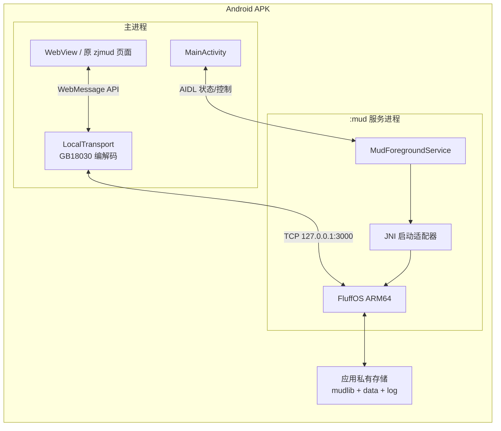
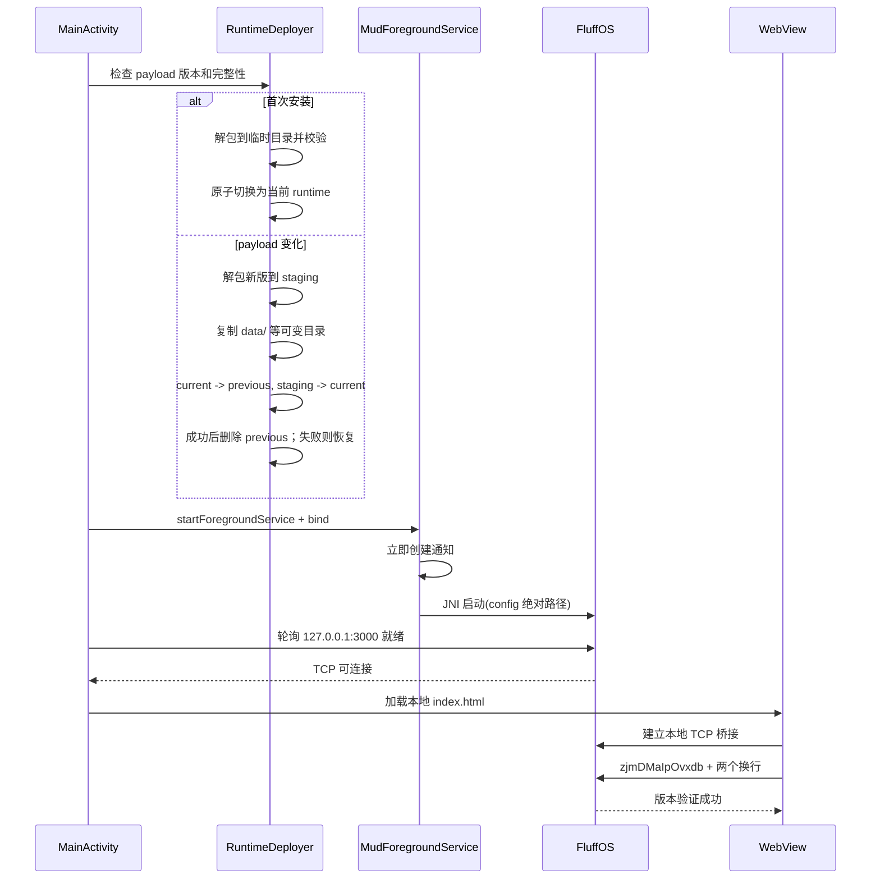

# 技术架构

## 1. 总体结构



## 2. 关键决策

### 2.1 FluffOS 使用独立服务进程和 JNI

推荐把 FluffOS 构建为 `libzjmud_driver.so`，由声明为 `android:process=":mud"`
的前台服务加载。JNI 入口在专用 native 线程调用重命名后的 FluffOS `main()`。

这样设计的原因：

- Android 正式支持从 APK 加载原生共享库。
- 不依赖从应用可写目录执行二进制，规避 Android 10 之后的执行限制。
- FluffOS 的 `exit()`、信号处理、全局状态和 native 崩溃被隔离在 `:mud` 进程。
- 服务重启时得到全新的进程状态，避免同一进程二次初始化旧驱动的全局变量。

备选方案是把伪装成 `.so` 的可执行文件放入 `nativeLibraryDir` 后用
`ProcessBuilder` 启动。它改动驱动较少，但依赖 APK 原生库提取和可执行权限行为，
长期兼容性弱于 JNI 服务进程，暂不作为主方案。

### 2.2 不携带 Node.js 和 Socket.IO 服务端

原 `web/main.js` 和 `web/webtelnet-proxy.js` 的职责只有：

- 提供静态网页。
- Socket.IO 与 TCP Telnet 之间转发文本。
- 将服务端 GB2312 字节解码为 JavaScript 字符串。
- 将 JavaScript 命令编码为 GB2312。
- TCP 连接建立后发送固定 Web 客户端握手。

Android 已有 WebView 静态资源加载和 TCP API。保留 Node.js 会增加运行时体积、旧依赖
维护面和第三个进程，却不提供额外游戏能力。因此用 Kotlin 实现等价传输层。

### 2.3 保留原 Web 页面，替换传输接口

新增 `local-transport.js`，在页面加载早期定义兼容对象：

```javascript
var sock = localTransport.connect();
sock.on('stream', handler);
sock.on('status', handler);
sock.on('connected', handler);
sock.on('disconnect', handler);
sock.emit('stream', command);
```

现有 `main.js` 的 UI 渲染和 ESC/zjmud 协议解析保持不变。AndroidX WebKit 的
WebMessage API 负责 JavaScript 与 Kotlin 之间通信，并把允许来源限制为应用资产域。

不直接使用 `addJavascriptInterface`，以减少接口暴露面并获得明确的来源限制。

## 3. 启动序列



部署和服务启动必须有超时、取消和错误状态。不能仅靠固定延迟判断服务已启动。

## 4. 本地传输协议

### 4.1 下行

1. Kotlin 使用单一 TCP 读取协程读取原始字节。
2. 使用可持续保留半个字符状态的 `CharsetDecoder` 解码 GB18030。
3. 解码后的字符串通过 WebMessage 发给页面的 `stream` 事件。
4. 页面继续使用现有的跨消息行缓存 `strsss` 处理不完整行。

不能对每个 TCP 包直接调用 `String(bytes, charset)`，否则中文字符在包边界被拆分时会
产生替换字符。

### 4.2 上行

1. 页面调用 `sock.emit('stream', text)`。
2. Kotlin 只接受 `stream` 类型和长度受限的字符串。
3. 使用 GB18030 编码器生成字节并完整写入 TCP。
4. 所有写入经一个串行队列执行，避免命令字节交错。

### 4.3 连接状态

传输层至少包含 `starting`、`connecting`、`connected`、`disconnected`、`failed` 状态。
握手只在每条新 TCP 连接上发送一次。服务尚未就绪时，页面命令应被拒绝或有限排队，
不能静默丢失登录信息。

## 5. 离线边界

纯单机需要同时约束前端、驱动和 LPC：

- `config.ini` 增加 `mud ip : 127.0.0.1`。
- 主游戏端口不得绑定 `0.0.0.0`。
- WebView 拦截并拒绝非应用资产 URL。
- 删除页面中的 MD5 CDN、充值地址和主页地址。
- Kotlin 传输层只允许连接固定回环地址和端口。
- 审计 LPC 的 socket efun。优先禁用 `PACKAGE_SOCKETS`；若游戏启动依赖它，则在驱动层
  限制只能使用回环地址。
- 不预载或启动 MUD 间 UDP/DNS、CMWHO 等网络服务。

应用仍可能需要声明普通权限 `android.permission.INTERNET` 才能使用 AF_INET 回环 TCP。
该权限本身不会发起外网通信，离线保证由上述代码限制和抓包测试共同提供。

## 6. 文件与数据布局

建议的应用私有目录：

```text
files/
  runtime/
    current -> versions/<payload-id>/
    versions/<payload-id>/
      config.android.ini
      mudlib/
        adm/ clone/ cmds/ d/ feature/ ...
        data/ log/ backup/ dump/
  exports-staging/
no_backup/
  native-crash/
cache/
  deploy-<uuid>/
```

首版可以把整个 mudlib 作为一个版本化归档资产。归档必须保留 LPC 文件原始字节和已
确认需要的文件名字节；ZIP 内存在非 ASCII 文件名，不能假设普通 Java ZIP 解包不会
改变名称。资源导入阶段必须先完成文件名编码审计。

所有 FluffOS 路径使用绝对路径生成 Android 专用配置。运行时工作目录也固定到 mudlib
根目录，不能依赖 Activity 当前目录。

## 7. 更新策略

- payload 使用内容哈希作为版本 ID。
- 首次部署采用“临时目录解包、逐文件校验、写完成标记、原子切换”。
- 同 payload 的 APK 覆盖安装直接复用现有 runtime，不覆盖玩家数据。
- payload 变化时迁移 `data`、`backup`、`log`、`dump`、`temp`、`adm/tmp` 和动态管理员
  列表 `adm/etc/wizlist`。
- 升级使用 `staging/current/previous` 目录原子交换；启动时可恢复交换中断的旧 runtime。

## 8. 服务保活与停止

服务在 `onStartCommand()` 返回 `START_NOT_STICKY`，并立即调用 `startForeground()`。这样用户
退出应用后，系统不会自行重建一个脱离 UI 的 MUD 服务。通知包含：

- 当前状态。
- 打开游戏操作。
- 停止服务操作。

最近任务被移除或服务销毁时，通过 `eventfd` 把停止请求送到 FluffOS 事件线程。驱动先
调用所有在线对象的 `save()` 并同步文件，再退出事件循环；服务限时等待驱动线程结束。
驱动同时每 30 秒保存在线对象，降低系统强杀无法执行回调时的最大回滚窗口。

编译 warning 在 Android 驱动中只写入 `android-driver.log`，不再调用 mudlib 的
`master.log_error()`，因此 unknown pragma、unused variable 等旧源码诊断不会进入玩家 UI；
真正的编译错误仍沿用原处理路径。

## 9. 单机反作弊兼容

原联网 mudlib 在登录时会因属性总和、第二个储物袋或未分配体会/付费条件，把玩家的
`startroom` 永久改为 `/d/death/block`。这些条件依赖联网服运营规则，不适用于个人单机版。

资源导入阶段通过 `tools/mudlib/remove_anticheat.patch` 删除三项自动判定，并移除
`summon1` 对小黑屋起点的写入。`d/death/block` 与 `d/death/shenxun` 保留为兼容释放房间：
旧存档登录时立即把起点改为正常客店并保存；若通过其他方式载入旧房间，则转移到扬州
武庙。通缉、捕快、杀人条件、长安大牢和管理员 prison 命令不属于该反作弊机制，保持原样。

## 10. 单机玩法倍率与权限

资源导入阶段通过 `tools/mudlib/singleplayer_boosts.patch` 应用个人单机版规则：

- 新角色初始化时由 `LOGIN_D` 写入 `(admin)` 安全等级，角色的 `is_admin()` 也认可该等级，
  因此完整管理员命令路径在首次进入世界时即可生效；`promote` 不再加载仅供联网版本同步的
  `VERSION_D`。已有普通角色不会被自动提权。
- `learn`、`practice`、`research` 和 `study` 的技能熟练度增量统一乘以 10；动作次数、
  精神消耗、潜能消耗及原有学习条件不变。
- 师门任务使用其专用奖励标记统一把经验、潜能、实战体会、正负神、江湖阅历、威望和
  门派贡献乘以 30；随机直接授予新武学的概率从原版 0.01% 提升 50 倍至 0.5%，授予等级
  仍保持原版 50 级。物品奖励、任务完成次数、
  连续次数、师门排行计数和任务流程不变。倍率在原版奖励上限及超限兜底计算完成后
  应用，确保潜能或体会已超限的角色得到的最终数值同样是原版的 30 倍。击杀师门目标
  时由 `killed.c` 发放的延迟数值奖励也携带师门标记，和交付任务奖励使用相同倍率。
- 四种八卦盘输出的目标房间名使用 `cmds:fly quest` 链接；命令只从当前击杀任务重新查找
  存活目标并飞往其当前环境，不接受客户端提供的 mudlib 路径。
- 少林石桌和洗髓经的奖励技能统一为 `unarmed`、`cuff`、`strike`、`finger`、`hand`、
  `claw` 六项基本空手。两处保留各自原有的技能等级范围、前置门槛、消耗和随机公式，
  只把每次实际增加的技能点乘以 500。
- 管理员移动房间时使用与普通玩家相同的到达提示，只显示房间名称，不把 mudlib 完整
  对象路径输出到中央控制台。

前台服务不构成绝对存活保证。验收文档必须把“正常后台和熄屏持续运行”与“用户强制
停止、系统极端内存压力、OEM 特殊策略”分开表述。
