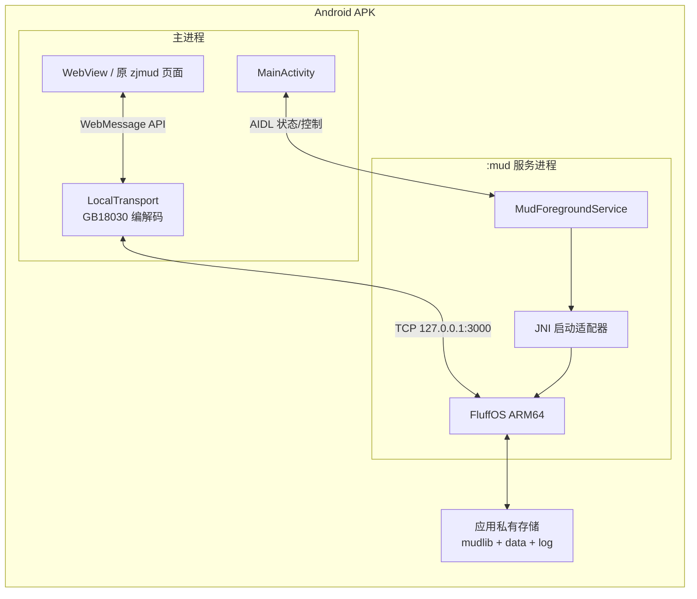
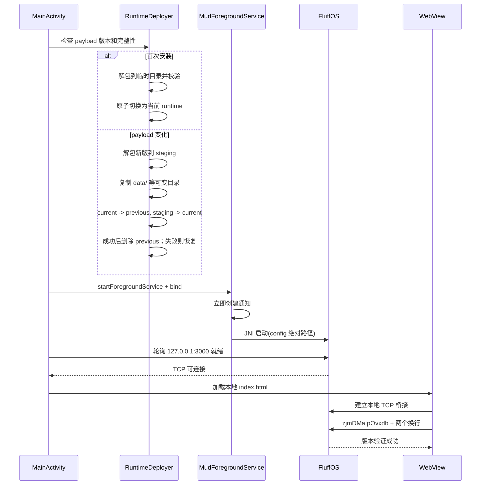

# 技术架构

## 1. 总体结构



## 2. 关键决策

### 2.1 FluffOS 使用独立服务进程和 JNI

推荐把 FluffOS 构建为 `libzjmud_driver.so`，由声明为 `android:process=":mud"`
的前台服务加载。JNI 入口在专用 native 线程调用重命名后的 FluffOS `main()`。

这样设计的原因：

- Android 正式支持从 APK 加载原生共享库。
- 不依赖从应用可写目录执行二进制，规避 Android 10 之后的执行限制。
- FluffOS 的 `exit()`、信号处理、全局状态和 native 崩溃被隔离在 `:mud` 进程。
- 服务重启时得到全新的进程状态，避免同一进程二次初始化旧驱动的全局变量。

备选方案是把伪装成 `.so` 的可执行文件放入 `nativeLibraryDir` 后用
`ProcessBuilder` 启动。它改动驱动较少，但依赖 APK 原生库提取和可执行权限行为，
长期兼容性弱于 JNI 服务进程，暂不作为主方案。

### 2.2 不携带 Node.js 和 Socket.IO 服务端

原 `web/main.js` 和 `web/webtelnet-proxy.js` 的职责只有：

- 提供静态网页。
- Socket.IO 与 TCP Telnet 之间转发文本。
- 将服务端 GB2312 字节解码为 JavaScript 字符串。
- 将 JavaScript 命令编码为 GB2312。
- TCP 连接建立后发送固定 Web 客户端握手。

Android 已有 WebView 静态资源加载和 TCP API。保留 Node.js 会增加运行时体积、旧依赖
维护面和第三个进程，却不提供额外游戏能力。因此用 Kotlin 实现等价传输层。

### 2.3 保留原 Web 页面，替换传输接口

新增 `local-transport.js`，在页面加载早期定义兼容对象：

```javascript
var sock = localTransport.connect();
sock.on('stream', handler);
sock.on('status', handler);
sock.on('connected', handler);
sock.on('disconnect', handler);
sock.emit('stream', command);
```

现有 `main.js` 的 UI 渲染和 ESC/zjmud 协议解析保持不变。AndroidX WebKit 的
WebMessage API 负责 JavaScript 与 Kotlin 之间通信，并把允许来源限制为应用资产域。

不直接使用 `addJavascriptInterface`，以减少接口暴露面并获得明确的来源限制。

## 3. 启动序列



部署和服务启动必须有超时、取消和错误状态。不能仅靠固定延迟判断服务已启动。

## 4. 本地传输协议

### 4.1 下行

1. Kotlin 使用单一 TCP 读取协程读取原始字节。
2. 使用可持续保留半个字符状态的 `CharsetDecoder` 解码 GB18030。
3. 解码后的字符串通过 WebMessage 发给页面的 `stream` 事件。
4. 页面继续使用现有的跨消息行缓存 `strsss` 处理不完整行。

不能对每个 TCP 包直接调用 `String(bytes, charset)`，否则中文字符在包边界被拆分时会
产生替换字符。

### 4.2 上行

1. 页面调用 `sock.emit('stream', text)`。
2. Kotlin 只接受 `stream` 类型和长度受限的字符串。
3. 使用 GB18030 编码器生成字节并完整写入 TCP。
4. 所有写入经一个串行队列执行，避免命令字节交错。

### 4.3 连接状态

传输层至少包含 `starting`、`connecting`、`connected`、`disconnected`、`failed` 状态。
握手只在每条新 TCP 连接上发送一次。服务尚未就绪时，页面命令应被拒绝或有限排队，
不能静默丢失登录信息。

## 5. 离线边界

纯单机需要同时约束前端、驱动和 LPC：

- `config.ini` 增加 `mud ip : 127.0.0.1`。
- 主游戏端口不得绑定 `0.0.0.0`。
- WebView 拦截并拒绝非应用资产 URL。
- 删除页面中的 MD5 CDN、充值地址和主页地址。
- Kotlin 传输层只允许连接固定回环地址和端口。
- 审计 LPC 的 socket efun。优先禁用 `PACKAGE_SOCKETS`；若游戏启动依赖它，则在驱动层
  限制只能使用回环地址。
- 不预载或启动 MUD 间 UDP/DNS、CMWHO 等网络服务。

应用仍可能需要声明普通权限 `android.permission.INTERNET` 才能使用 AF_INET 回环 TCP。
该权限本身不会发起外网通信，离线保证由上述代码限制和抓包测试共同提供。

## 6. 文件与数据布局

建议的应用私有目录：

```text
files/
  runtime/
    current -> versions/<payload-id>/
    versions/<payload-id>/
      config.android.ini
      mudlib/
        adm/ clone/ cmds/ d/ feature/ ...
        data/ log/ backup/ dump/
  exports-staging/
no_backup/
  native-crash/
cache/
  deploy-<uuid>/
```

首版可以把整个 mudlib 作为一个版本化归档资产。归档必须保留 LPC 文件原始字节和已
确认需要的文件名字节；ZIP 内存在非 ASCII 文件名，不能假设普通 Java ZIP 解包不会
改变名称。资源导入阶段必须先完成文件名编码审计。

所有 FluffOS 路径使用绝对路径生成 Android 专用配置。运行时工作目录也固定到 mudlib
根目录，不能依赖 Activity 当前目录。

## 7. 更新策略

- payload 使用内容哈希作为版本 ID。
- 首次部署采用“临时目录解包、逐文件校验、写完成标记、原子切换”。
- 同 payload 的 APK 覆盖安装直接复用现有 runtime，不覆盖玩家数据。
- payload 变化时迁移 `data`、`backup`、`log`、`dump`、`temp`、`adm/tmp` 和动态管理员
  列表 `adm/etc/wizlist`。
- 升级使用 `staging/current/previous` 目录原子交换；启动时可恢复交换中断的旧 runtime。

## 8. 服务保活与停止

服务在 `onStartCommand()` 返回 `START_NOT_STICKY`，并立即调用 `startForeground()`。这样用户
退出应用后，系统不会自行重建一个脱离 UI 的 MUD 服务。通知包含：

- 当前状态。
- 打开游戏操作。
- 停止服务操作。

最近任务被移除或服务销毁时，通过 `eventfd` 把停止请求送到 FluffOS 事件线程。驱动先
调用所有在线对象的 `save()` 并同步文件，再退出事件循环；服务限时等待驱动线程结束。
驱动同时每 30 秒保存在线对象，降低系统强杀无法执行回调时的最大回滚窗口。

编译 warning 在 Android 驱动中只写入 `android-driver.log`，不再调用 mudlib 的
`master.log_error()`，因此 unknown pragma、unused variable 等旧源码诊断不会进入玩家 UI；
真正的编译错误仍沿用原处理路径。

## 9. 完整角色持久化

原版角色 `save_object()` 已保存用户对象中非 `static` 的永久属性，但位置只依赖
`startroom`，物品只恢复实现 `query_autoload()` 的对象，且很多固定装备不记录穿戴状态。
Android 单机版通过 `feature/fullsave.c` 在原存档内增加版本化快照：

- 保存当前非克隆、安全房间的 mudlib 路径；克隆房间、`close_room`、`out_room`、
  `no_login` 和 `no_save_location` 场景不覆盖上一个安全位置。
- 递归记录角色背包和容器，节点包含源码路径、可序列化 dbase、原 autoload 参数、子物品
  以及 `worn/wielded` 状态。
- 登录时先重建完整物品树，再统一恢复护具、主手和副手，避免套装计算发生在物品未齐时。
- 新快照存在时忽略同时保存的旧 autoload 列表，防止物品重复；只有旧 autoload 的存档仍按
  原逻辑恢复，并在登录后的首次保存自动转换为新格式。
- `restore()` 成功后设置一个非持久化的一次性恢复门闩，`setup()` 只有消费该门闩时才能
  回放完整物品树。在线保存会更新快照但不会重新打开门闩，因此物品使用、权限刷新或更新
  逻辑再次调用 `setup()` 时不会复制整个背包。
- 物品源码缺失或无法克隆时跳过该节点，并尽量把其子物品恢复到上一级容器；错误写入
  `log/fullsave`，不能阻断角色登录。

对象引用、函数、NPC、临时 dbase、战斗关系和 `call_out` 不是稳定存档数据，恢复时重新
初始化。快照限制为 12 层和 500 个非角色对象，避免损坏或恶意对象树耗尽求值资源。
底层 FluffOS `save_object()` 本身先写同目录 `.tmp`，关闭成功后再 `rename` 正式 `.o`，
因此角色属性与完整快照作为同一个原子文件提交。

### WebView 文本操作

Web 客户端不再覆盖 `document.oncontextmenu`，Android `WebView` 保持长按能力。普通输出区
使用 Chromium 原生文本选择 ActionMode，输入控件在剪贴板存在内容时提供粘贴操作；应用
不实现私有剪贴板，也不把所选文字发送给 MUD 服务端。

## 10. AI 玩家运行时

首版 AI 玩家完全位于 LPC/mudlib 内，不经过 Android UI，也不依赖外部语言模型。预载守护
`/adm/daemons/ai_playerd` 创建并持有 5 个真实 `USER_OB` 克隆；每个角色都有独立的
`data/login/a/ai_*.o` 和 `data/user/a/ai_*.o`，因此沿用普通玩家的属性、装备、战斗、死亡和
完整快照机制，但不需要伪造 TCP 连接。

- `ai_` 为保留账号前缀，登录守护拒绝人类客户端接管这些角色。
- 玩家对象只在恢复后、读取安全房间和执行 `setup()` 前，由 AI 守护调用受限入口恢复自身
  euid；入口校验调用者路径，不改变普通玩家权限，也不把 AI 提升为管理员。
- AI 守护创建的 `LOGIN_OB` 与驱动创建的网络登录对象不同，会继承克隆者的 euid。守护在
  恢复或填充登录资料后，通过仅接受 `ai_` 账号且校验调用者的入口清空其 euid；随后原登录
  守护的 `make_body()` 同样先受限降权新角色对象，再把账号 ID 的 uid 导出给登录对象和角色
  对象；填充角色字段后，两者以自身 uid 恢复 euid，最后才保存登录档。AI 守护在启动时先
  显式加载原 `securityd`，避免 master 在安全守护缺席时拒绝全部写入；原生克隆对象自存档
  规则和全局 `valid_write` 不变。首次保存异常会销毁两个临时对象，不会遗留半初始化角色，
  加载失败后至少等待 30 秒再试，避免心跳错误风暴。
- 守护进程每两秒检查调度时间，单个角色的行为间隔为 8 至 17 秒。需求先决定目标，目标
  生成结构化意图，意图再经过 `run_action()` 白名单调用 `force_me()`；允许移动、说话、
  观察、表情和受控饮食，不接受任意 LPC 或模型文本命令。
- 每名角色有早晨、白天、傍晚和夜间四段日程、独立兴趣点、语句、胆量、停留时间和路线
  索引。区域内的有界 BFS 最多检查 160 个节点和
  18 层深度，排除竞技、副本、监狱、克隆房间及 `close_room/out_room/no_login/
  no_save_location` 场景；找不到安全路径时只在安全相邻房间中漫游。成功路径的首步缓存
  300 秒，移动没有换房时立即失效；`validate` 检查全部日程目的地及常驻点往返路径。
- AI 守护为非交互玩家补齐普通玩家心跳跳过的食物和饮水消耗；低于 35% 时通过白名单
  `eat/drink` 使用临时随身补给，补给对象用后销毁，不进入角色快照。低气血或精神时驻足
  恢复。离开区域、失去环境或死亡时回到安全常驻点。
- AI 不主动攻击玩家，但作为真实玩家对象保留原战斗系统的自卫和低血量逃跑行为。暂停只
  冻结行为与生存消耗，周期保存、对象重建和死亡恢复仍继续。
- 守护进程通过同房对象快照差分生成玩家进入/离开、附近战斗开始/结束、自身战斗开始/结束
  和时段切换事件；`say` relay 与 `ask` 命令显式生成带来源和主题的事件。每名角色的队列
  最多 16 条，4 秒内同类同源同内容事件去重，满载时优先丢弃低优先级旧项；若新事件优先级
  不高于队列最低项则丢弃新事件。决策按优先级消费事件，
  不解析 UI 或战斗文本，也不修改通用移动、消息和战斗核心。
- v1.3 活动状态机为每个角色提供至少两项带目标、步骤、冷却和结果的角色活动。活动使用
  已验证的观察、对白和补给动作；问询、危险、自身战斗或路径失败可以中断活动，事件处理后
  自动恢复，连续三次动态移动失败则取消活动并直接回安全常驻点。活动开始、完成、中断、
  恢复、路径失败和重定位均进入指标，避免单个 `valid_leave` 守门 NPC 造成无限重试。
- v1.4 将苏晚棠补给活动移至醉仙楼，先查找自有包子/酒袋，再通过白名单 `buy` 购买一件，
  并校验库存增加、货币减少及 `eat/drink` 后食物或饮水上升；缺钱、商人忙碌或后置条件失败
  都进入适配器指标并结束本轮活动，不会无限重试。训练暂不接入通用 `practice/exercise`，
  因为这些命令存在技能映射和自动 callout，尚未形成可验证的角色专用适配器。
- v1.4 提供管理员专用的 `/d/standalone/ai_test` 隔离房间和一次性木桩。`scenario combat <id>`
  只启动非致死 `fight_ob`，结束后恢复房间、气血、精神、内力、活动和敌对状态，并要求结构化
  `self_combat_started/self_combat_ended` 事件都被观察到；场景旁观事件不会改变正常日程。
- 角色最多保存 12 名真实玩家的熟悉度、姓名、最近见面时间和话题；单个玩家每天最多增长
  3 点熟悉度。`0-2/3-9/10-29/30+` 分别对应陌生、认识、熟悉和朋友，改变进场招呼、说话
  回复与问询语气。最近 6 个房间用于减少短距离来回折返。
- v1.6 的进场招呼先按熟悉度决定称呼和主动程度，再从当前时段及少量角色专属房间语境中
  选择内容。活动执行器支持按有序站点完成多点巡游、在安全目标房间分阶段休息并校验恢复
  上限、到配置商人处真实购买/消费，以及两个空闲 AI 在同区域安全会面点碰面交谈。结伴
  不使用通用 `team/follow`，不会跨区域传送或覆盖伙伴正在执行的活动。
- 每 300 秒保存一次，守护移除和 MUD 关闭时保存全部角色。管理员可用
  `aiplayer status|pause|resume|reload|save` 控制全局；`metrics [id]` 查看动作、错误、BFS 节点、
  缓存、事件和活动计数，`events <id>` 查看待处理队列，`validate` 校验日程与路径，
  `selftest [id]` 做非破坏性队列/关系/缓存/活动自检，并可用
  `inspect/trace/home/reset <id>` 查看或恢复单个角色。`scenario combat <id>` 运行隔离战斗回归，
  `scenario status <id>` 查看结果，`activity supplies <id>` 强制补给活动；仅测试时使用
  `activity supplies <id> seed` 注入 30 银验证真实购买路径。`metrics` 还显示适配器和场景计数。
  `stability` 提供机器可读的驱动对象数、AI 加载数、错误、动作失败、路径失败、重定位、
  复活、事件积压和动作计数，只用于自动稳定性采样。

首版刻意不包含跨区域寻路、任务与经济规划、主动 PK、私聊/频道参与、组队、长期记忆和
外部模型调用。后续扩展应继续让策略层输出结构化意图，由动作白名单验证后执行，不能把
任意模型文本直接作为 MUD 指令运行。

## 11. 单机反作弊兼容

原联网 mudlib 在登录时会因属性总和、第二个储物袋或未分配体会/付费条件，把玩家的
`startroom` 永久改为 `/d/death/block`。这些条件依赖联网服运营规则，不适用于个人单机版。

资源导入阶段通过 `tools/mudlib/remove_anticheat.patch` 删除三项自动判定，并移除
`summon1` 对小黑屋起点的写入。`d/death/block` 与 `d/death/shenxun` 保留为兼容释放房间：
旧存档登录时立即把起点改为正常客店并保存；若通过其他方式载入旧房间，则转移到扬州
武庙。通缉、捕快、杀人条件、长安大牢和管理员 prison 命令不属于该反作弊机制，保持原样。

## 12. 单机玩法倍率与权限

资源导入阶段通过 `tools/mudlib/singleplayer_boosts.patch` 应用个人单机版规则：

- 新角色初始化时由 `LOGIN_D` 写入 `(admin)` 安全等级，角色的 `is_admin()` 也认可该等级，
  因此完整管理员命令路径在首次进入世界时即可生效；`promote` 不再加载仅供联网版本同步的
  `VERSION_D`。已有普通角色不会被自动提权。
- `learn`、`practice`、`research` 和 `study` 的技能熟练度增量统一乘以 10；动作次数、
  精神消耗、潜能消耗及原有学习条件不变。
- `jiqu`/`derive` 每个忙碌周期消耗的未吸收实战体会乘以 20，武学修养或持剑时的剑道
  修养增量继续由实际消耗量按原公式计算，因此转化速度同步为原版 20 倍。显式指定数量
  时以剩余请求量封顶，避免最后一个周期超扣；附带经验和潜能不跟随放大。
- 师门任务使用其专用奖励标记统一把经验、潜能、实战体会、正负神、江湖阅历、威望和
  门派贡献乘以 100；随机直接授予新武学的概率从原版 0.01% 提升 100 倍至 1%，授予等级
  仍保持原版 50 级。物品奖励、任务完成次数、
  连续次数、师门排行计数和任务流程不变。倍率在原版奖励上限及超限兜底计算完成后
  应用，确保潜能或体会已超限的角色得到的最终数值同样是原版的 100 倍。击杀师门目标
  时由 `killed.c` 发放的延迟数值奖励也携带师门标记，和交付任务奖励使用相同倍率。
- 四种八卦盘输出的目标房间名使用 `cmds:fly quest` 链接；`fly quest` 和 `goto quest` 只从
  当前 `quest`/`bquest` 击杀任务重新查找目标并移动到其当前环境，`kill quest` 只攻击同房间
  的该任务目标。三条命令均不接受客户端提供的 mudlib 路径或任意对象。
- 少林石桌和洗髓经的奖励技能统一为 `unarmed`、`cuff`、`strike`、`finger`、`hand`、
  `claw` 六项基本空手。两处保留各自原有的技能等级范围、前置门槛、消耗和随机公式，
  只把每次实际增加的技能点乘以 500。
- 整点异域挑战的日本、天竺和西洋挑战者会通过 `ic` 发布战败消息。原版频道配置随后把
  本地消息转交 `gchannel`，而单机版按网络边界移除了 `dns_master`，因此挑战者心跳会在
  `gchannel.c` 加载该守护进程时报执行时段错误。导入时移除 `wiz/ic/ultra` 的跨服字段，
  并以离线空实现替换 `gchannel`，因此旧映射或残余调用也不会触碰 `dns_master`；本地频道
  显示保持不变。跨服私聊、回复、查询和 telnet 入口在加载网络服务前明确拒绝。
- 同次审计还修复了挑战者死亡和胜利结算中的 `call_out("destruct", ...)`：改由对象自身
  包装函数调用 `destruct` efun，并让空伤害映射、零总伤害和非正掉落概率安全跳过。正常
  经验、潜能、威望、阅历及掉落公式不变。
- 单机导入将所有仍可被本地命令懒加载的联网守护替换为离线实现：`dns_master` 返回空
  MUD/服务拓扑，`messaged` 保留本地玩家查找、私聊和输出 API，`versiond` 保留本地状态
  并拒绝同步、拉取和发布，`cmwhod`、`payd` 与 telnet shadow 为无网络空实现。旧 network
  service 即使被残余路径调用，也只能经过离线 `dns_master`，不会访问 socket efun。
- 导入阶段扫描完整 payload，要求 `socket_create/bind/listen/accept/connect/write/close/release/
  acquire/status/address/error`、`resolve()`、`external_start()` 与 `db_connect()` 调用数量为零。
  同时禁止调用未随单机版提供的 `INETD`、`NETMAIL_D`、`TELNET_D`、`FTP_D` 等联网守护。
  该约束覆盖预载、命令懒加载、NPC 心跳和管理员路径，不依赖仅移除某一个入口。
- `adm/daemons/network/services` 下 22 个旧 inter-MUD service 和 `network/fs.c` 统一替换为宽
  API 离线对象。发送、收包与远程查询返回 no-op 或离线结果，状态查询返回空值，因此不会
  继续链式加载原版不存在的 `INETD`、`NETMAIL_D` 或其他 service。
- Web 客户端只保留本地 `LocalMudConnection` 登录和注册协议；根 `main.js` 同步覆盖历史
  `js/main.js` 副本，并移除旧站 API AJAX、充值页和主页打开函数中的外部 URL。WebView URL
  allowlist 仍作为第二层边界。自动登录可能早于登录对话框初始化，所有关闭操作先检查
  jQuery UI 初始化标记，避免本地连接成功后因 `dialog("close")` 抛错中断登录流程。
- WebView 的 Safe Browsing 与使用统计上报在设置和 manifest 两层关闭；此外在创建 WebView
  前安装全局代理覆盖，除本地资产域名外的流量全部指向不可用的 `127.0.0.1:9`。不支持代理
  覆盖的 WebView 失败关闭并不创建页面。页面请求仍由本地资源 allowlist 拦截，因此首次创建
  WebView 数据时，提供方自身的 SafeNet/Variations 初始化也不能建立设备外连接。
- 管理员移动房间时使用与普通玩家相同的到达提示，只显示房间名称，不把 mudlib 完整
  对象路径输出到中央控制台。

前台服务不构成绝对存活保证。验收文档必须把“正常后台和熄屏持续运行”与“用户强制
停止、系统极端内存压力、OEM 特殊策略”分开表述。
